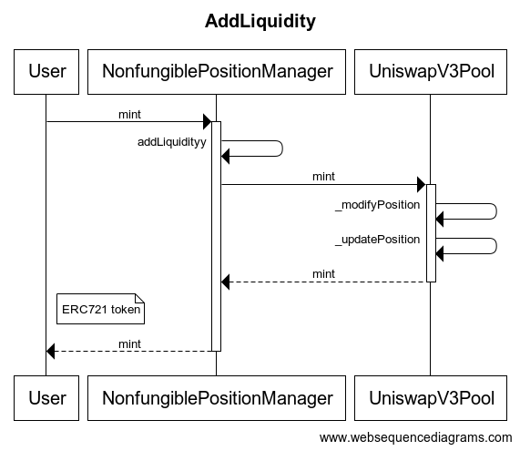

#  Uniswap V3 源码解析（一）

    author: Thomas_Xu
之前看了v2的源码，但是感觉能写的不多，于是便决定读了v3后把v3和v2连着写一一篇博文。
v3版本的实现复杂度和v2已经不是一个量级了，部分算法确实难以摸透。尝试着分析分析吧。

## 写在前面
强烈建议在阅读uniswap v3源码之前，先阅读[官方博客](https://uniswap.org/blog/uniswap-v3)对v3版本的介绍，有能力的话摸透V3的[白皮书](https://uniswap.org/whitepaper-v3.pdf)，熟悉他的实现原理。在本文中也会做出简短的介绍

## Uniswap v3 白皮书导读
### 集中流动性
其实V3最大的改变就是 **“集中流动性”** 这个概念，大大提高了资金的利用率。
早期版本旨在提供整个价格范围为(0, +∞)的流动性，这很容易实现并且可以有效地聚合流动性，但这意味着池中持有的大部分资产永远不会被触及，这使得资金的利用率很低。例如，v2版本中的DAI/USDC对仅保留约0.50%的资本用于在0.99美元和1.01美元之间进行交易，这是LP期望看到最多交易量并因此赚取最多费用的价格范围。

考虑到这一点，允许LP将其流动性集中在比(0,+∞)更小的价格范围内似乎是合理的，在Uniswap V3中将流动性集中在一个有限范围内称为头寸，一个头寸只需要保持足够的储备来支持其范围内的交易，就像V2的一个池子一样。

在Uniswap v3中，LP可以将资金集中在自定义价格范围内，以所需的价格提供更多的流动性。在此过程中，LP构建了反映其自身偏好的个性化价格曲线。

LP可以在单个池中组合任意数量的不同集中头寸。例如，ETH/DAI 池中的 LP 可以选择将 $100 分配给 $1，000-$2，000 的价格范围，并将 $50 分配给 $1，500-$1，750。
### 资本效率
通过集中其流动性，LP可以在指定的价格范围内提供与v2相同的流动性深度，同时将更少的资本置于风险中。节省的资金可以存放在外部，投资于不同的资产，存放在DeFi的其他地方，或用于在指定的价格范围内增加敞口以赚取更多的交易费用。


让我们举个例子来说明：
> Alice和Bob都想在Uniswap v3上的ETH/DAI池中提供流动性，他们每人有100万美元，目前ETH的价格是1500DAI。 
Alice决定在整个价格范围内部署她的资本(就像她在Uniswap v2中一样)，于是她存入50万DAI和333.33ETH(共值100万美元)
Bob则建立了一个集中的仓位，只在1000到2250的价格范围内存款，他存入了91751DAI和61.17ETH，总价值约18.35万美元，他自己保留了另外的81.65万美元，按照自己的喜好进行投资。
此时Alice投入的资金是Bob的5.44倍，但只要ETH/DAI价格保持在1000到2250的区间内，则他们赚取的费用是一样的。


Bob的定制仓位也是他流动资金的一种止损，如果ETH价格跌至0美元，Alice和Bob的流动资金都将完全以ETH计价，然而Bob将只损失15.9万美元，而Alice则损失100万美元，Bob可以用他额外的816,500美元来对冲下行风险，或者投资于任何其他可以想象的策略。

Uniswap v3中LP不需要像v2中的LP那样以较少的资本提供同等的流动性深度，而是可以选择与v2 LP一样以相同的资本量提供更大的深度，这就需要承担更多的价格风险(无常损失)，同时支持更多的交易量，赚取更高的费用.

### 活跃的流动性
如果市场价格超出LP的指定价格范围，则其流动性将从池中有效移除，并且不再赚取费用。在这种状态下，LP的流动性完全由两种资产中价值较低的资产组成，直到市场价格回到其指定的价格范围，或者他们决定更新其范围以考虑当前价格。


### 范围订单
非常小的范围内的头寸的作用类似于限价单——如果超出范围，头寸将从完全由一种资产组成，转变为完全由另一种资产组成(加上应计费用)，这个范围指令和传统的限价指令有两个区别:
* 一个仓位的范围有多窄是有限制的，当价格在这个范围内时，限价单可能会被部分执行
* 当仓位被越过时，它需要撤回，如果价格回穿该范围，则该头寸将被交易回，从而有效地逆转交易


### 灵活的手续费选择
v3 版本内置了三种梯度的手续费率（0.05%, 0.30%, and 1.00%），同时可以在未来增加更多的费率值。关于手续费的计算过程，这部分放在后文来详解。需要注意的是，由于需要支持多种费率，同一个代币对 v3 版本会有多个不同的流动池。例如 ETH/DAI 代币对，会分成三个池，分别对应 0.05%, 0.30%, 1.00% 的手续费。

### 价格精度问题
因为用户可以在任意 [P0,P1] 价格区间内提供流动性，Uniswap v3 需要保存每一个用户提供流动性的边界价格，即 P0 和 P1。这样就引入了一个新的问题，假设两个用户提供的流动性价格下限分别是 5.00000001 和 5.00000002，那么 Uniswap 需要标记价格为 5.00000001 和 5.00000002 的对应的流动性大小。同时当交易发生时，需要将 [5.00000001,5.00000002] 作为一个单独的价格区间进行计算。这样会导致：
* 几乎很难有两个流动性设置相同的价格边界，这样会导致消耗大量合约存储空间保存这些状态
* 当进行交易计算时，价格变化被切分成很多个小的范围区间，需要逐一分段进行计算，这会消耗大量的 gas，并且如果范围的价差太小，可能会引发计算精度的问题

Uniswap v3 解决这个问题的方式是，将 [Pmin,Pmax] 这一段连续的价格范围为，分割成有限个离散的价格点。每一个价格对应一个 **tick**，用户在设置流动性的价格区间时，只能选择这些离散的价格点中的某一个作为流动性的边界价格。
Uniswap v3 采用了等比数列的形式确定价格数列，公比为 1.0001。即下一个价格点为当前价格点的 100.01%。
如此一来 Uniswap v3 可以提供比较细粒度的价格选择范围（每个可选价格之间的差值为 0.01%），同时又可以将计算的复杂度控制在一定范围内。

### tick 管理
简单说，一个 tick 就代表 Uniswap 价格的等比数列中的某一个价格(公比为1.001)，因此每一个用户提供的流动性的价格边界可以用 ticklower 和 tickupper 来表示。为了计算的方便，对于每一个交易对，uni 都定义有一个价格为 1 的 tick。

    这样一来，只需要通过整数索引 i 就能找到对应的 tick，并且 i 为 0 时价格为 1.
Uniswap 不需要记录每个 tick 所有的信息，只需要记录所有作为 upper/lower tick 所包含的流动性元数据即可。看下面这个例子：

两个用户分别在 [a,c] 和 [b,d] 两个区间提供了流动性 L1 和 L2，对于 Uniswap 来说它会在 a, b, c, d 四个 tick 上记录对应的流动性增减情况。例如当价格从图中从左向右移动时，代币池的流动性需要做对应的增减（即从左侧 tick 进入一个流动性时增加流动性，移出流动性的右侧 tick 时减去相应的流动性）。

* **手续费与 tick 的关系**
我们知道tick越多，价格可选的值越细，但是合约在计算时候的价格区间就可能越多，那么 gas 消耗也会更加的多，因此我们需要让 tick 的数量保持在一个合理的范围内。Uniswap 针对不同类型的代币对推荐使用不同类型的费率。
例如稳定比交易对 USDC/USDT，它的范围波动比较小，我们需要给它更精细的价格可选值，并且设置一个比较低的手续费（0.05%）。Uniswap 引入了 tickSpacing 的概念，即每个 tick 之间跳过 N 个 tick，这样让合约在计算的时候，gas 更可控。
对于价格波动较小的交易池，我们希望 tickSpacing 更小，这样价格可选值更多，同时也希望费率更低。反之波动大的交易对，可以让 tickSpacing 更大，这样更节约 gas，但是我们希望它的费率更高。

## 源码解读
### 代码结构
v3的代码结构和v2几乎没有区别，将合约分成了两个仓库：

* [uniswap-v3-core](https://github.com/Uniswap/uniswap-v3-core)
* [uniswap-v3-periphery](https://github.com/Uniswap/uniswap-v3-periphery)
  

core 仓库的功能主要包含在以下 2 个合约中：

* **UniswapV3Factory**：提供创建 pool 的接口，并且追踪所有的 pool
  
* **UniswapV3Pool**：实现代币交易，流动性管理，交易手续费的收取，oracle 数据管理。接口的实现粒度比较低，不适合普通用户使用，错误的调用其中的接口可能会造成经济上的损失。
  

periphery仓库的功能主要包含在以下2个合约中：

* **SwapRouter**：提供代币交易的接口，它是对 UniswapV3Pool 合约中交易相关接口的进一步封装，前端界面主要与这个合约来进行对接。
* **NonfungiblePositionManager：** 用来增加/移除/修改 Pool 的流动性，并且通过 NFT token 将流动性代币化。使用 ERC721 token（v2 使用的是 ERC20）的原因是同一个池的多个流动性并不能等价替换（v3 的集中流性动功能）。


这是uniswap v3基本的一个架构，其主要业务流程是在Management和Pool之间进行交互。
NonfungiblePositionManager负责交易池的创建以及流动性的添加删除。SwapRouter是swap路由的管理。UniswapV3Factory是交易池(UniswapV3Pool)统一创建的接口。UniswapV3Pool由UniswapV3PoolDeployer统一部署。UniswapV3Pool是核心逻辑，管理了Tick和Position，实现流动性管理以及一个交易池中swap功能实现。每个Pool中的Position都做成了ERC721的Token。也就是说，每个Position都有独立的ERC721的Token ID。

### 创建交易对
创建交易对的调用流程如下：

用户首先调用`NonfungiblePositionManager`合约继承的`createAndInitializePoolIfNecessary`方法创建交易对，传入的参数为交易对的 token0, token1, fee 和初始价格。

createAndInitializePoolIfNecessary 如下：
```
function createAndInitializePoolIfNecessary(
        address token0,
        address token1,
        uint24 fee,
        uint160 sqrtPriceX96
    ) external payable override returns (address pool) {
        require(token0 < token1);
        pool = IUniswapV3Factory(factory).getPool(token0, token1, fee);

        if (pool == address(0)) {
            pool = IUniswapV3Factory(factory).createPool(token0, token1, fee);  //创建pool
            IUniswapV3Pool(pool).initialize(sqrtPriceX96);                      //初始化
        } else {
            (uint160 sqrtPriceX96Existing, , , , , , ) = IUniswapV3Pool(pool).slot0();
            if (sqrtPriceX96Existing == 0) {
                IUniswapV3Pool(pool).initialize(sqrtPriceX96);
            }
        }
    }
```

`createAndInitializePoolIfNecessary`方法内部通过调用 UniswapV3Factory 的 `createPool` 方法完成交易对的创建，然后对交易对进行初始化，初始化的作用就是给交易对设置一个初始的价格。

首先调用`UniswapV3Factory.getPool`方法查看交易对是否已经创建,`getPool`函数是 solidity 自动为 `UniswapV3Factory` 合约中的状态变量`getPool`生成的外部函数`getPool`的数据类型为：

```
contract UniswapV3Factory is IUniswapV3Factory, UniswapV3PoolDeployer, NoDelegateCall {
    ...
    mapping(address => mapping(address => mapping(uint24 => address))) public override getPool;
    ...
}
```
使用 3个 map 说明了 v3 版本使用 (tokenA, tokenB, fee) 来作为一个交易对的键，即相同代币，不同费率之间的流动池不一样。另外对于给定的 tokenA 和 tokenB，会先将其地址排序，将地址值更小的放在前，这样方便后续交易池的查询和计算。

再来看 UniswapV3Factory **创建交易对的过程**，实际上它是调用`deploy`函数完成交易对的创建：
```
function deploy(
    address factory,
    address token0,
    address token1,
    uint24 fee,
    int24 tickSpacing
) internal returns (address pool) {
    parameters = Parameters({factory: factory, token0: token0, token1: token1, fee: fee, tickSpacing: tickSpacing});
    pool = address(new UniswapV3Pool{salt: keccak256(abi.encode(token0, token1, fee))}());
    delete parameters;
}
```
这里采用了`Create2`的方式创建Pool池，关于Create2的使用，可以看我的另一篇文章。
这里简单讲一下使用Create2的好处
* 可以在链下计算出已经创建的交易池的地址
* 其他合约不必通过`UniswapV3Factory`中的接口来查询交易池的地址，可以节省 gas
* 合约地址不会因为 reorg 而改变

我们再来看一下`UniswapV3Pool`的构造函数：

```
constructor() {
    int24 _tickSpacing;
    (factory, token0, token1, fee, _tickSpacing) = IUniswapV3PoolDeployer(msg.sender).parameters();
    tickSpacing = _tickSpacing;

    maxLiquidityPerTick = Tick.tickSpacingToMaxLiquidityPerTick(_tickSpacing);
}
```
比较值得注意的是这里反向查询了Deployer里面的`parameters`变量进行赋值，而不是通过传参的方式。
其实是因为Create2。这是因为`CREATE2`会将合约的 `initcode` 和 `salt` 一起用来计算创建出的合约地址。而 `initcode` 是包含 `contructor code` 和其参数的，如果合约的 `constructor` 函数包含了参数，那么其 initcode将因为其传入参数不同而不同。

为了让合约地址的计算更简单，这里的 constructor 不包含参数（这样合约的 initcode 将时唯一的），是使用动态 call 的方式来获取其创建参数。

最后，对创建的交易对合约进行初始化：
```
function initialize(uint160 sqrtPriceX96) external override {
    require(slot0.sqrtPriceX96 == 0, 'AI');

    int24 tick = TickMath.getTickAtSqrtRatio(sqrtPriceX96);

    (uint16 cardinality, uint16 cardinalityNext) = observations.initialize(_blockTimestamp());

    slot0 = Slot0({
        sqrtPriceX96: sqrtPriceX96,
        tick: tick,
        observationIndex: 0,
        observationCardinality: cardinality,
        observationCardinalityNext: cardinalityNext,
        feeProtocol: 0,
        unlocked: true
    });
    // 此时池子中还没有流动性
    emit Initialize(sqrtPriceX96, tick);
}
```
初始化主要是设置了交易池的初始价格（注意，此时池子中还没有流动性），以及费率，tick 等相关变量的初始化。完成之后一个交易池就创建好了。

### 提供流动性
在合约内 v3会保存所有用户的流动性，代码内称作`Position`，

用户还是首先和`NonfungiblePositionManager`合约交互,调用`mint`函数，mint函数会调用`LiquidityManagement.sol`里的`addLiquidity`函数，来进行流动性的增添。v3 这次将 ERC20 的 LP token 改成了 ERC721 token，并且将 token 功能放到`NonfungiblePositionManager`合约中。这个合约替代用户完成提供流动性操作，然后根据将流动性的数据元记录下来，并给用户铸造一个 NFT Token.

我们先来看添加流动性的函数:
```
struct AddLiquidityParams {
    address token0;     // token0 的地址
    address token1;     // token1 的地址
    uint24 fee;         // 交易费率
    address recipient;  // 流动性的所属人地址
    int24 tickLower;    // 流动性的价格下限（以 token0 计价），这里传入的是 tick index
    int24 tickUpper;    // 流动性的价格上线（以 token0 计价），这里传入的是 tick index
    uint128 amount;     // 流动性 L 的值
    uint256 amount0Max; // 提供的 token0 上限数
    uint256 amount1Max; // 提供的 token1 上限数
}

function addLiquidity(AddLiquidityParams memory params)
    internal
    returns (
        uint256 amount0,
        uint256 amount1,
        IUniswapV3Pool pool
    )
{
    PoolAddress.PoolKey memory poolKey =
        PoolAddress.PoolKey({token0: params.token0, token1: params.token1, fee: params.fee});

    // 这里不需要访问 factory 合约，可以通过 token0, token1, fee 三个参数计算出 pool 的合约地址
    pool = IUniswapV3Pool(PoolAddress.computeAddress(factory, poolKey));

    (amount0, amount1) = pool.mint(
        params.recipient,
        params.tickLower,
        params.tickUpper,
        params.amount,
        // pool 合约回调所使用的参数
        abi.encode(MintCallbackData({poolKey: poolKey, payer: msg.sender}))
    );

    require(amount0 <= params.amount0Max);
    require(amount1 <= params.amount1Max);
}
```

#### 回调函数

在uniswap v3中有个比较特殊的设计就是在提供流动性的流程中，不是在代码逻辑内部进行token和流动性的转换，而实通过回调函数的方式进行**转账**。
```
struct MintCallbackData {
    PoolAddress.PoolKey poolKey;
    address payer;         // 支付 token 的地址
}

/// @inheritdoc IUniswapV3MintCallback
function uniswapV3MintCallback(
    uint256 amount0Owed,
    uint256 amount1Owed,
    bytes calldata data
) external override {
    MintCallbackData memory decoded = abi.decode(data, (MintCallbackData));
    CallbackValidation.verifyCallback(factory, decoded.poolKey);

    // 根据传入的参数，使用 transferFrom 代用户向 Pool 中支付 token
    if (amount0Owed > 0) pay(decoded.poolKey.token0, decoded.payer, msg.sender, amount0Owed);
    if (amount1Owed > 0) pay(decoded.poolKey.token1, decoded.payer, msg.sender, amount1Owed);
}
```

使用回调函数原因是，将`Position`的`owner`和实际流动性`token`支付者解耦。这样可以让中间合约来管理用户的流动性，并将流动性`token`化。关于`token`化，Uniswap v3 默认实现了 ERC721 token（因为即使是同一个池子，流动性之间差异也也很大）。
#### Tick管理
Tick合约包含用于管理报价过程和相关计算的函数，下面我们进行逐一分析：

首先声明一个`info`结构体，用于存储每个初始化后个人的trick信息，具体代码如下所示：
```
    struct Info {
        // the total position liquidity that references this tick
        uint128 liquidityGross;
        // amount of net liquidity added (subtracted) when tick is crossed from left to right (right to left),
        int128 liquidityNet;
        // fee growth per unit of liquidity on the _other_ side of this tick (relative to the current tick)
        // only has relative meaning, not absolute — the value depends on when the tick is initialized
        uint256 feeGrowthOutside0X128;
        uint256 feeGrowthOutside1X128;
        // the cumulative tick value on the other side of the tick
        int56 tickCumulativeOutside;
        // the seconds per unit of liquidity on the _other_ side of this tick (relative to the current tick)
        // only has relative meaning, not absolute — the value depends on when the tick is initialized
        uint160 secondsPerLiquidityOutsideX128;
        // the seconds spent on the other side of the tick (relative to the current tick)
        // only has relative meaning, not absolute — the value depends on when the tick is initialized
        uint32 secondsOutside;
        // true iff the tick is initialized, i.e. the value is exactly equivalent to the expression liquidityGross != 0
        // these 8 bits are set to prevent fresh sstores when crossing newly initialized ticks
        bool initialized;
    }
```
`tickSpacingToMaxLiquidityPerTick`函数用于根据给定的tickSpacing得出每一个trick的最大流动性值：
```
    //e.g., a tickSpacing of 3 requires ticks to be initialized every 3rd tick i.e., ..., -6, -3, 0, 3, 6, ...
    // @return The max liquidity per tick
    function tickSpacingToMaxLiquidityPerTick(int24 tickSpacing) internal pure returns (uint128) {
        int24 minTick = (TickMath.MIN_TICK / tickSpacing) * tickSpacing;
        int24 maxTick = (TickMath.MAX_TICK / tickSpacing) * tickSpacing;
        uint24 numTicks = uint24((maxTick - minTick) / tickSpacing) + 1;
        return type(uint128).max / numTicks;
    }
```

`getFeeGrowthInside`函数用于检查费用增长的数据：
```
    function getFeeGrowthInside(
        mapping(int24 => Tick.Info) storage self,
        int24 tickLower,
        int24 tickUpper,
        int24 tickCurrent,
        uint256 feeGrowthGlobal0X128,
        uint256 feeGrowthGlobal1X128
    ) internal view returns (uint256 feeGrowthInside0X128, uint256 feeGrowthInside1X128) {
        Info storage lower = self[tickLower];
        Info storage upper = self[tickUpper];
 
        // calculate fee growth below
        uint256 feeGrowthBelow0X128;
        uint256 feeGrowthBelow1X128;
        if (tickCurrent >= tickLower) {
            feeGrowthBelow0X128 = lower.feeGrowthOutside0X128;
            feeGrowthBelow1X128 = lower.feeGrowthOutside1X128;
        } else {
            feeGrowthBelow0X128 = feeGrowthGlobal0X128 - lower.feeGrowthOutside0X128;
            feeGrowthBelow1X128 = feeGrowthGlobal1X128 - lower.feeGrowthOutside1X128;
        }
 
        // calculate fee growth above
        uint256 feeGrowthAbove0X128;
        uint256 feeGrowthAbove1X128;
        if (tickCurrent < tickUpper) {
            feeGrowthAbove0X128 = upper.feeGrowthOutside0X128;
            feeGrowthAbove1X128 = upper.feeGrowthOutside1X128;
        } else {
            feeGrowthAbove0X128 = feeGrowthGlobal0X128 - upper.feeGrowthOutside0X128;
            feeGrowthAbove1X128 = feeGrowthGlobal1X128 - upper.feeGrowthOutside1X128;
        }
 
        feeGrowthInside0X128 = feeGrowthGlobal0X128 - feeGrowthBelow0X128 - feeGrowthAbove0X128;
        feeGrowthInside1X128 = feeGrowthGlobal1X128 - feeGrowthBelow1X128 - feeGrowthAbove1X128;
    }
```
`update`函数用于更新trick，每当trick从初始化转为未初始化时需要更新trick并返回真，反之亦然.
```
    function update(
        mapping(int24 => Tick.Info) storage self,
        int24 tick,
        int24 tickCurrent,
        int128 liquidityDelta,
        uint256 feeGrowthGlobal0X128,
        uint256 feeGrowthGlobal1X128,
        uint160 secondsPerLiquidityCumulativeX128,
        int56 tickCumulative,
        uint32 time,
        bool upper,
        uint128 maxLiquidity
    ) internal returns (bool flipped) {
        Tick.Info storage info = self[tick];
 
        uint128 liquidityGrossBefore = info.liquidityGross;
        uint128 liquidityGrossAfter = LiquidityMath.addDelta(liquidityGrossBefore, liquidityDelta);
 
        require(liquidityGrossAfter <= maxLiquidity, 'LO');
 
        flipped = (liquidityGrossAfter == 0) != (liquidityGrossBefore == 0);
 
        if (liquidityGrossBefore == 0) {
            // by convention, we assume that all growth before a tick was initialized happened _below_ the tick
            if (tick <= tickCurrent) {
                info.feeGrowthOutside0X128 = feeGrowthGlobal0X128;
                info.feeGrowthOutside1X128 = feeGrowthGlobal1X128;
                info.secondsPerLiquidityOutsideX128 = secondsPerLiquidityCumulativeX128;
                info.tickCumulativeOutside = tickCumulative;
                info.secondsOutside = time;
            }
            info.initialized = true;
        }
 
        info.liquidityGross = liquidityGrossAfter;
 
        // when the lower (upper) tick is crossed left to right (right to left), liquidity must be added (removed)
        info.liquidityNet = upper
            ? int256(info.liquidityNet).sub(liquidityDelta).toInt128()
            : int256(info.liquidityNet).add(liquidityDelta).toInt128();
    }
```
`clear`函数用于清除trick数据
```
    function clear(mapping(int24 => Tick.Info) storage self, int24 tick) internal {
        delete self[tick];
    }
```
`cross`函数用于根据价格变动的需要转换到下一个trick
```
    function cross(
        mapping(int24 => Tick.Info) storage self,
        int24 tick,
        uint256 feeGrowthGlobal0X128,
        uint256 feeGrowthGlobal1X128,
        uint160 secondsPerLiquidityCumulativeX128,
        int56 tickCumulative,
        uint32 time
    ) internal returns (int128 liquidityNet) {
        Tick.Info storage info = self[tick];
        info.feeGrowthOutside0X128 = feeGrowthGlobal0X128 - info.feeGrowthOutside0X128;
        info.feeGrowthOutside1X128 = feeGrowthGlobal1X128 - info.feeGrowthOutside1X128;
        info.secondsPerLiquidityOutsideX128 = secondsPerLiquidityCumulativeX128 - info.secondsPerLiquidityOutsideX128;
        info.tickCumulativeOutside = tickCumulative - info.tickCumulativeOutside;
        info.secondsOutside = time - info.secondsOutside;
        liquidityNet = info.liquidityNet;
    }
```
#### tick 位图
tick 位图用于记录所有被引用的 lower/upper tick index，我们可以用过 tick 位图，从当前价格找到下一个（从左至右或者从右至左）被引用的 tick index。关于 tick 位图的管理，在 _updatePosition 中的：
```
if (flippedLower) {
    tickBitmap.flipTick(tickLower, tickSpacing);
    secondsOutside.initialize(tickLower, tick, tickSpacing, blockTimestamp);
}
if (flippedUpper) {
    tickBitmap.flipTick(tickUpper, tickSpacing);
    secondsOutside.initialize(tickUpper, tick, tickSpacing, blockTimestamp);
}
```
这里不做进一步的说明，具体代码实现在`TickBitmap`库中。tick 位图有以下几个特性：
* 对于不存在的 tick，不需要初始值，因为访问 map 中不存在的 key 默认值就是 0
* 通过对位图的每个 word(uint256) 建立索引来管理位图，即访问路径为 word index -> word -> tick bit

#### 完成流动性添加
`_modifyPosition`调用完成后，会返回 x token, 和 y token 的数量。再来看 UniswapV3Pool.mint 的代码：
```
function mint(
    address recipient,
    int24 tickLower,
    int24 tickUpper,
    uint128 amount,
    bytes calldata data
) external override lock returns (uint256 amount0, uint256 amount1) {
    require(amount > 0);
    (, int256 amount0Int, int256 amount1Int) =
        _modifyPosition(
            ModifyPositionParams({
                owner: recipient,
                tickLower: tickLower,
                tickUpper: tickUpper,
                liquidityDelta: int256(amount).toInt128()
            })
        );

    amount0 = uint256(amount0Int);
    amount1 = uint256(amount1Int);

    uint256 balance0Before;
    uint256 balance1Before;
    // 获取当前池中的 x token, y token 余额
    if (amount0 > 0) balance0Before = balance0();
    if (amount1 > 0) balance1Before = balance1();
    // 将需要的 x token 和 y token 数量传给回调函数，这里预期回调函数会将指定数量的 token 发送到合约中
    IUniswapV3MintCallback(msg.sender).uniswapV3MintCallback(amount0, amount1, data);
    // 回调完成后，检查发送至合约的 token 是否复合预期，如果不满足检查则回滚交易
    if (amount0 > 0) require(balance0Before.add(amount0) <= balance0(), 'M0');
    if (amount1 > 0) require(balance1Before.add(amount1) <= balance1(), 'M1');

    emit Mint(msg.sender, recipient, tickLower, tickUpper, amount, amount0, amount1);
}
```
这个函数关键的步骤就是通过回调函数，让调用方发送指定数量的 x token 和 y token 至合约中。

再来看`NonfungiblePositionManager.mint`的代码：
```
function mint(MintParams calldata params)
    external
    payable
    override
    checkDeadline(params.deadline)
    returns (
        uint256 tokenId,
        uint256 amount0,
        uint256 amount1
    )
{
    IUniswapV3Pool pool;
    // 这里是添加流动性，并完成 x token 和 y token 的发送
    (amount0, amount1, pool) = addLiquidity(
        AddLiquidityParams({
            token0: params.token0,
            token1: params.token1,
            fee: params.fee,
            recipient: address(this),
            tickLower: params.tickLower,
            tickUpper: params.tickUpper,
            amount: params.amount,
            amount0Max: params.amount0Max,
            amount1Max: params.amount1Max
        })
    );

    // 铸造 ERC721 token 给用户，用来代表用户所持有的流动性
    _mint(params.recipient, (tokenId = _nextId++));

    bytes32 positionKey = PositionKey.compute(address(this), params.tickLower, params.tickUpper);
    (, uint256 feeGrowthInside0LastX128, uint256 feeGrowthInside1LastX128, , ) = pool.positions(positionKey);

    // idempotent set
    uint80 poolId =
        cachePoolKey(
            address(pool),
            PoolAddress.PoolKey({token0: params.token0, token1: params.token1, fee: params.fee})
        );

    // 用 ERC721 的 token ID 作为键，将用户提供流动性的元信息保存起来
    _positions[tokenId] = Position({
        nonce: 0,
        operator: address(0),
        poolId: poolId,
        tickLower: params.tickLower,
        tickUpper: params.tickUpper,
        liquidity: params.amount,
        feeGrowthInside0LastX128: feeGrowthInside0LastX128,
        feeGrowthInside1LastX128: feeGrowthInside1LastX128,
        tokensOwed0: 0,
        tokensOwed1: 0
    });
}
```
可以看到这个函数主要是将用户的 Position 保存起来，并给用户铸造 NFT token，代表其所持有的流动性。至此提供流动性的步骤就完成了。

#### 流动性的移除
流动性的移除其实就是上述操作的逆操作，在`burn`函数中
```
function burn(
    int24 tickLower,
    int24 tickUpper,
    uint128 amount
) external override lock returns (uint256 amount0, uint256 amount1) {
    // 先计算出需要移除的 token 数
    (Position.Info storage position, int256 amount0Int, int256 amount1Int) =
        _modifyPosition(
            ModifyPositionParams({
                owner: msg.sender,
                tickLower: tickLower,
                tickUpper: tickUpper,
                liquidityDelta: -int256(amount).toInt128()
            })
        );

    amount0 = uint256(-amount0Int);
    amount1 = uint256(-amount1Int);

    // 注意这里，移除流动性后，将移出的 token 数记录到了 position.tokensOwed 上
    if (amount0 > 0 || amount1 > 0) {
        (position.tokensOwed0, position.tokensOwed1) = (
            position.tokensOwed0 + uint128(amount0),
            position.tokensOwed1 + uint128(amount1)
        );
    }

    emit Burn(msg.sender, tickLower, tickUpper, amount, amount0, amount1);
}
```
### 交易过程
v3 的`UniswapV3Pool`提供了比较底层的交易接口，而在`SwapRouter`合约中封装了面向用户的交易接口：
* **exactInput:** 指定交易对路径，付出的 x token 数和预期得到的最小 y token 数（x, y 可以互换）
* **exactOutput:** 指定交易路径，付出的 x token 最大数和预期得到的 y token 数（x, y 可以互换）

#### 路径
关于上文提到的交易路径，在进行两个代币交易时，是首先需要在链下计算出交易的路径，例如使用`ETH -> DAI `：
* 可以直接通过`ETH/DAI`的交易池完成
* 也可以通过`ETH -> USDC -> DAI`路径，即经过`ETH/USDC`, `USDC/DAI`两个交易池完成交易

Uniswap 的前端会帮用户实时计算出最优路径（即交易的收益最高），作为参数传给合约调用。前端中这部分计算的具体实现在这里，具体过程为先用需要交易的输入代币，输出代币，以及一系列可用的中间代币（代码中叫 Base token）生成所有的路径（当然为了降低复杂度，路径中最多包含3个代币），然后遍历每个路径输出的输出代币数量，最后选取最佳路径.
事实上因为 v3 引入了费率的原因，在路径选择的过程中还需要考虑费率的因素。

### 交易入口
交易入口是`exactInput`函数，代码如下：
```
struct ExactInputParams {
    bytes path;                 // 路径
    address recipient;          // 收款地址
    uint256 deadline;           // 交易有效期
    uint256 amountIn;           // 输入的 token 数（输入的 token 地址就是 path 中的第一个地址）
    uint256 amountOutMinimum;   // 预期交易最少获得的 token 数（获得的 token 地址就是 path 中最后一个地址）
}

function exactInput(ExactInputParams memory params)
    external
    payable
    override
    checkDeadline(params.deadline)
    returns (uint256 amountOut)
{
    // 通过循环，遍历传入的路径，进行交易
    while (true) {
        bool hasPools = params.path.hasPools();

        // 完成当前路径的交易
        params.amountIn = exactInputSingle(
            params.amountIn,
            // 如果是中间交易，又合约代为收取和支付中间代币
            hasPools ? address(this) : params.recipient,
            // 给回调函数用的参数
            SwapData({
                path: params.path.getFirstPool(),
                payer: msg.sender
            })
        );

        // 如果路径全部遍历完成，则退出循环，交易完成
        if (hasPools) {
            // 步进 path 中的值
            params.path = params.path.skipToken();
        } else {
            amountOut = params.amountIn;
            break;
        }
    }

    // 检查交易是否满足预期
    require(amountOut >= params.amountOutMinimum, 'Too little received');
}
```

#### 路径的编码

细心看的话其实可以知道上面输入的参数中 `path` 字段是 `bytes` 类型，通过这样可以实现更加紧凑的编码。Uniswap会将`bytes`作为一个数组使用，bytes类型就是一连串的`byte1`,因此相比普通数组其结构更加紧凑。在 Uniswap V3 中 `path`内部编码结构如下图：


图中展示了一个包含 2个路径（pool0, 和 pool1）的 path 编码。Uniswap 将编码解码操作封装在了 `Path` 库中，本文不再赘述其过程。每次交易时，会取出头部的 `tokenIn`, `tokenOut`, `fee`，使用这三个参数找到对应的交易池，完成交易。

#### 单个池的交易过程

单个池的交易在 `exactInputSingle` 函数中：

```solidity
function exactInputSingle(
    uint256 amountIn,
    address recipient,
    SwapData memory data
) private returns (uint256 amountOut) {
    // 将 path 解码，获取头部的 tokenIn, tokenOut, fee
    (address tokenIn, address tokenOut, uint24 fee) = data.path.decodeFirstPool();

    // 因为交易池只保存了 token x 的价格，这里我们需要知道输入的 token 是交易池 x token 还是 y token
    bool zeroForOne = tokenIn < tokenOut;

    // 完成交易
    (int256 amount0, int256 amount1) =
        getPool(tokenIn, tokenOut, fee).swap(
            recipient,
            zeroForOne,
            amountIn.toInt256(),
            zeroForOne ? MIN_SQRT_RATIO : MAX_SQRT_RATIO,
            // 给回调函数用的参数
            abi.encode(data)
        );

    return uint256(-(zeroForOne ? amount1 : amount0));
}
```

交易过程是先获取交易池，然后确定本次交易的输出是交易池的`token x`还是`token y`

这是因为交易池中只保存了x的价格，所以`token x`和`token y`的计算公式是不一样的。最用再调用`UniswapV3Pool`的`swap`完成交易。

#### 交易分解

`UniswapV3Pool.swap` 函数比较长，这里简要描述其交易步骤：

假设支付的token为x，价格为：
$$
\sqrt(P) = \sqrt(\frac{y}{x} )
$$


